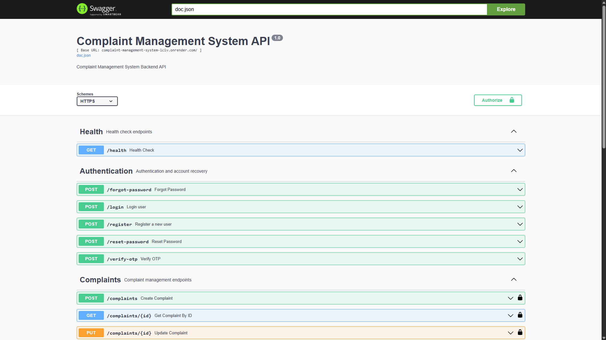
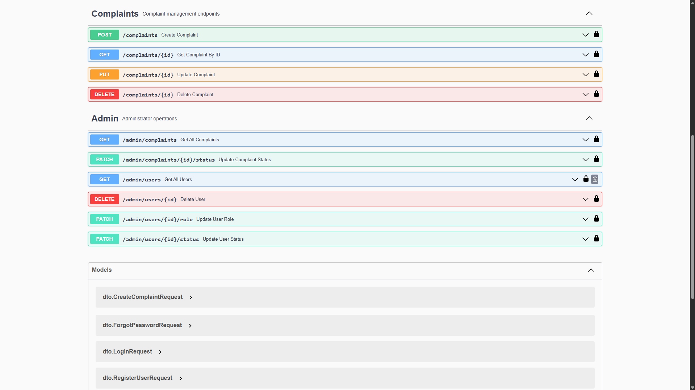
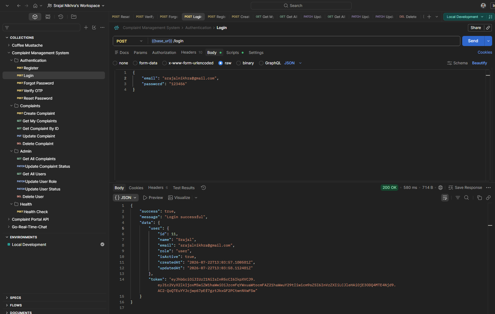
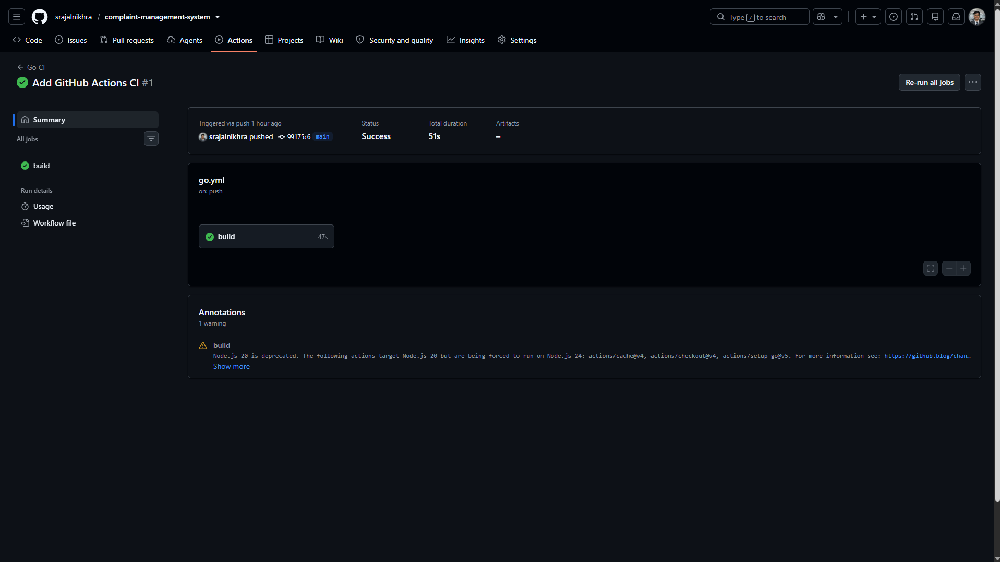
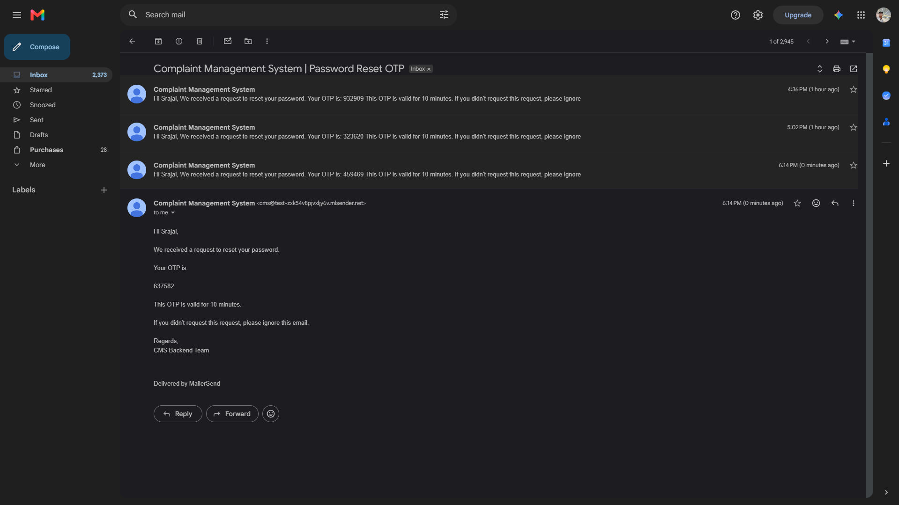
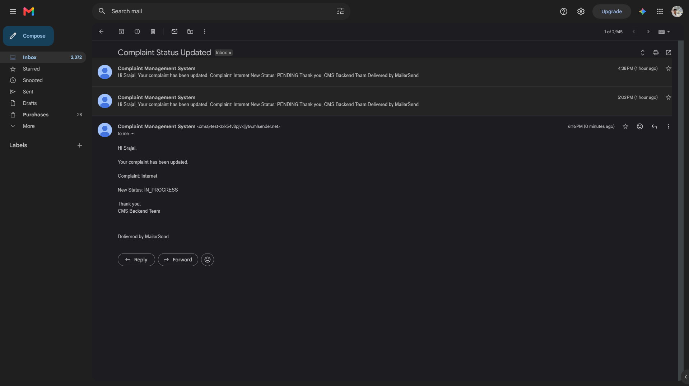
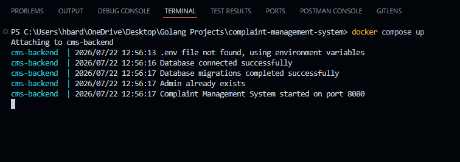
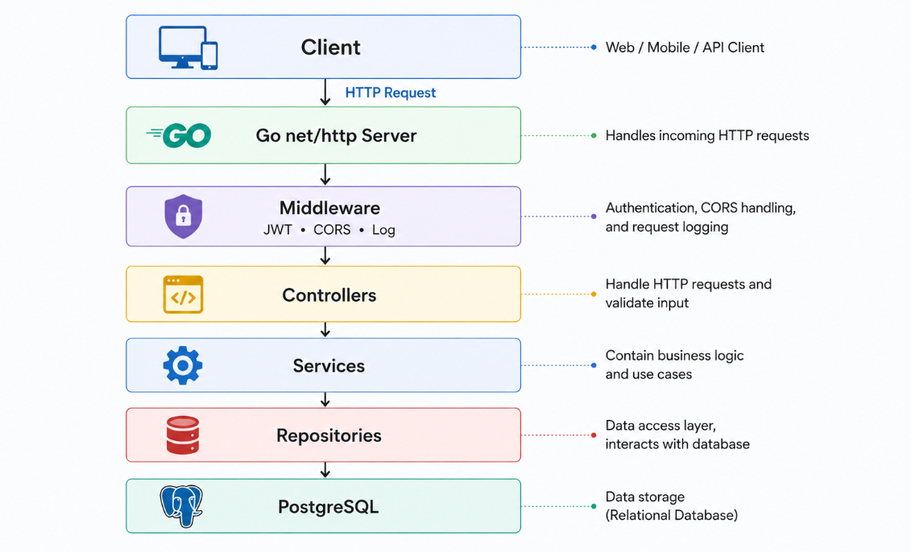
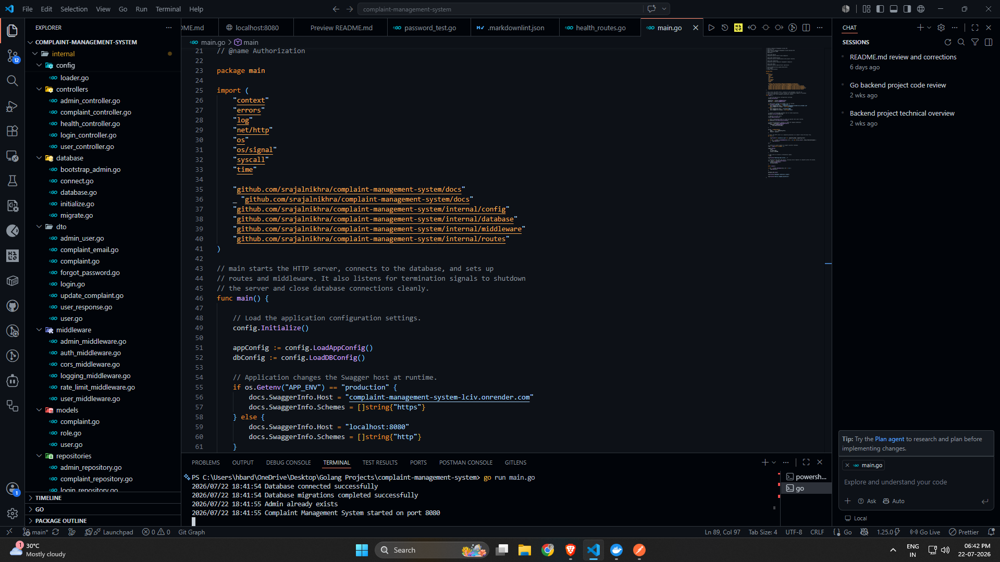

<div align="center">

# 🧾 Complaint Management System

**A backend REST API for managing complaints — built with Go, PostgreSQL, JWT authentication, Docker, and clean architecture.**

[](https://go.dev)
[](https://www.postgresql.org/)
[](https://www.docker.com/)
[](https://complaint-management-system-lciv.onrender.com/swagger/index.html)
[](https://github.com/srajalnikhra/complaint-management-system/actions/workflows/go.yml)

[Overview](#-overview) • [Features](#-features) • [API Reference](#-api-reference) • [Getting Started](#-getting-started) • [Docker](#-run-with-docker) • [Security](#-security)

</div>

---

## 📖 Overview

**Complaint Management System (CMS)** is a backend service where users can create complaints, track them, and manage their account — while admins can view every complaint, search and filter them, update their status, and manage users.

It's built in plain Go using the standard `net/http` package (no framework like Gin or Echo). Data is stored in PostgreSQL, login works through JWT tokens, and the whole project can run either directly with `go run` or inside Docker.

The API is documented with Swagger, generated straight from the code, so the docs always match what's actually running.

---

## 🌐 Live Demo

- Backend API:
[https://complaint-management-system-lciv.onrender.com](https://complaint-management-system-lciv.onrender.com)

- Swagger UI:
[https://complaint-management-system-lciv.onrender.com/swagger/index.html](https://complaint-management-system-lciv.onrender.com/swagger/index.html)

---

## ✨ Features

### 🔐 Authentication

- User registration
- User login
- JWT authentication
- Password hashing with bcrypt
- Forgot password (OTP sent by email)
- OTP verification
- Password reset
- Protected routes
- Role-based access (user / admin)

### 📝 Complaint Management

- Create a complaint
- View your own complaints
- Get a complaint by ID
- Update a complaint
- Delete a complaint

### 👨‍💼 Admin

- View all complaints
- Search complaints
- Filter by status
- Sort and order results
- Pagination
- Update complaint status
- View all users
- Update a user's role
- Activate / deactivate a user
- Delete a user

### ⚙️ Backend

- PostgreSQL database
- Docker & Docker Compose support
- Auto-creates database tables on startup
- Request validation
- Consistent API response format
- Health check endpoint
- Request logging
- Rate limiting on sensitive routes
- Graceful shutdown
- Creates a default admin account automatically
- Email notifications (MailerSend API)
- Swagger API documentation

---

## 🛠 Tech Stack

| Category          | Technology              |
| ----------------- | ----------------------- |
| Language          | Go                      |
| Database          | PostgreSQL              |
| Authentication    | JWT                     |
| Password Security | bcrypt                  |
| API Documentation | Swagger (OpenAPI)       |
| Email Service     | MailerSend API          |
| Containerization  | Docker & Docker Compose |
| Deployment        | Render                  |
| Cloud Database    | Neon PostgreSQL         |
| CI                | GitHub Actions          |

---

## 📂 Project Structure

```text
complaint-management-system/
├── .github/
│   └── workflows/
├── docs/
├── internal/
│   ├── config/
│   ├── controllers/
│   ├── database/
│   ├── dto/
│   ├── middleware/
│   ├── migrations/
│   ├── models/
│   ├── repositories/
│   ├── routes/
│   ├── services/
│   ├── utils/
│   └── validation/
├── postman/
├── screenshots/
├── scripts/
├── .env.example
├── Dockerfile
├── docker-compose.yml
├── go.mod
├── go.sum
├── main.go
└── README.md
```

---

## 📡 API Reference

### Local

- **API:** `http://localhost:8080`
- **Swagger UI:** `http://localhost:8080/swagger/index.html`

### Production

- **API:** `https://complaint-management-system-lciv.onrender.com`
- **Swagger UI:** `https://complaint-management-system-lciv.onrender.com/swagger/index.html`

🔒 **Protected routes require the `Authorization` header with a valid JWT token.**

### Authentication

| Method | Endpoint           | Auth | Description                        |
| ------ | ------------------ | :--: | ---------------------------------- |
| POST   | `/register`        |  –   | Create a new account               |
| POST   | `/login`           |  –   | Log in and get a JWT token         |
| POST   | `/forgot-password` |  –   | Send a password-reset OTP to email |
| POST   | `/verify-otp`      |  –   | Verify the OTP                     |
| POST   | `/reset-password`  |  –   | Set a new password using the OTP   |

### Profile

| Method | Endpoint   | Auth | Description                 |
| ------ | ---------- | :--: | --------------------------- |
| GET    | `/profile` |  🔒  | Check that you're logged in |

### Complaints (User)

| Method | Endpoint           | Auth | Description                     |
| ------ | ------------------ | :--: | ------------------------------- |
| POST   | `/complaints`      |  🔒  | Create a complaint              |
| GET    | `/complaints`      |  🔒  | List your complaints            |
| GET    | `/complaints/{id}` |  🔒  | Get one complaint (yours only)  |
| PUT    | `/complaints/{id}` |  🔒  | Update a complaint (yours only) |
| DELETE | `/complaints/{id}` |  🔒  | Delete a complaint (yours only) |

### Admin — Complaints

| Method | Endpoint                        |   Auth   | Query Params                                         | Description                                             |
| ------ | ------------------------------- | :------: | ---------------------------------------------------- | ------------------------------------------------------- |
| GET    | `/admin/complaints`             | 🔒 Admin | `page`, `limit`, `search`, `status`, `sort`, `order` | List all complaints, with search/filter/sort/pagination |
| PATCH  | `/admin/complaints/{id}/status` | 🔒 Admin | –                                                    | Change a complaint's status                             |

### Admin — Users

| Method | Endpoint                   |   Auth   | Description                           |
| ------ | -------------------------- | :------: | ------------------------------------- |
| GET    | `/admin/users`             | 🔒 Admin | List all users                        |
| PATCH  | `/admin/users/{id}/role`   | 🔒 Admin | Change a user's role                  |
| PATCH  | `/admin/users/{id}/status` | 🔒 Admin | Activate / deactivate a user          |
| DELETE | `/admin/users/{id}`        | 🔒 Admin | Delete a user (can't delete yourself) |

### System

| Method | Endpoint     | Auth | Description                       |
| ------ | ------------ | :--: | --------------------------------- |
| GET    | `/health`    |  –   | Check that the service is running |
| GET    | `/swagger/*` |  –   | Swagger UI and API docs           |

**17 endpoints in total**, all documented in Swagger.

Every response follows the same simple format:

```json
{
  "status": true,
  "message": "Complaint created successfully",
  "data": { "...": "..." }
}
```

---

## 🚀 Getting Started

Follow these steps to run the project on your own machine.

### What you'll need

- [Go](https://go.dev/dl/) 1.25 or later installed
- [PostgreSQL](https://www.postgresql.org/download/) installed and running (or use Docker — see below)
- [Git](https://git-scm.com/) installed
- Docker & Docker Compose (optional, only needed if you want to run it in containers)

### 1. Clone the repository

```bash
git clone https://github.com/srajalnikhra/complaint-management-system.git
cd complaint-management-system
```

### 2. Install dependencies

```bash
go mod download
```

### 3. Set up your environment variables

Copy the example env file:

```bash
cp .env.example .env
```

Then open `.env` and fill in your own values:

| Variable              | What it's for                             |
|-----------------------|-------------------------------------------|
| `APP_NAME`            | Name shown in logs / health check         |
| `APP_ENV`             | `development`, `production`, etc.         |
| `APP_PORT`            | Port the server runs on (default `8080`)  |
| `DB_HOST`             | Database host (`localhost` for local)     |
| `DB_PORT`             | Database port (default `5432`)            |
| `DB_USER`             | Your PostgreSQL username                  |
| `DB_PASSWORD`         | Your PostgreSQL password                  |
| `DB_NAME`             | Database name to use                      |
| `DB_SSLMODE`          | SSL mode (`disable` for local dev)        |
| `JWT_SECRET`          | A secret key used to sign login tokens    |
| `JWT_EXPIRY`          | How long a token stays valid (e.g. `24h`) |
| `MAILERSEND_API_KEY`  | MailerSend API key                        |
| `SENDER_NAME`         | Sender name displayed in emails           |
| `SENDER_EMAIL`        | Sender email address                      |

### 4. Create the database

Make sure PostgreSQL is running, then create a database with the name you set in `DB_NAME`:

```bash
createdb complaint_management
```

(Or create it manually using any Postgres client — pgAdmin, psql, TablePlus, etc.)

> You don't need to run any migration files by hand — the app creates all the required tables automatically the first time it starts, and also creates a default admin account for you.

### 5. Run the application

```bash
go run main.go
```

If everything is set up correctly, you'll see a log message saying the server has started.

- API base URL: **[http://localhost:8080](http://localhost:8080)**
- Swagger docs: **[http://localhost:8080/swagger/index.html](http://localhost:8080/swagger/index.html)**
- Health check: **[http://localhost:8080/health](http://localhost:8080/health)**
- Production: **[https://complaint-management-system-lciv.onrender.com](https://complaint-management-system-lciv.onrender.com)**
- Production Swagger docs: **[https://complaint-management-system-lciv.onrender.com/swagger/index.html](https://complaint-management-system-lciv.onrender.com/swagger/index.html)**

---

## 🐳 Run with Docker

If you'd rather not install Go or PostgreSQL locally, you can run everything with Docker instead.

### 1. Make sure you have a `.env` file

```bash
cp .env.example .env
```

Fill in the values as described above (for Docker, `DB_HOST` inside the container is handled automatically — just fill in the rest).

### 2. Build and start the containers

```bash
docker compose up -d --build
```

This starts two containers:

- `cms-backend` — the Go API, on port `8080`
- `cms-postgres` — PostgreSQL, on port `5432`

### 3. Start containers again later (without rebuilding)

```bash
docker compose up -d
```

### 4. Stop everything

```bash
docker compose down
```

---

## 🚀 Deployment

- **Backend:** Render
- **Database:** Neon PostgreSQL
- **Email Service:** MailerSend
- **CI/CD:** GitHub Actions
- **API Documentation:** Swagger (OpenAPI)

---

## 🧪 API Testing

To test all API endpoints using Postman:

### 1. Import the Postman Collection

```text
postman/Complaint Management System.postman_collection.json
```

### 2. Import the Environment

```text
postman/Local Development.postman_environment.json
```

### 3. Start the application

```bash
go run main.go
```

### 4. Base URL

```text
http://localhost:8080
```

### 5. Test the APIs

Select the **Local Development** environment in Postman and run the requests
individually, or use the **Collection Runner** to execute the entire
collection.

---

## 📸 Screenshots

### Swagger UI

Interactive API documentation generated using Swagger/OpenAPI.

<p align="center">
  
</p>

---

### Swagger Endpoints

All authentication, complaint, and admin endpoints documented and testable.

<p align="center">
  
</p>

---

### Postman Collection

Complete Postman collection for testing every API endpoint.

<p align="center">
  
</p>

---

### GitHub Actions (CI)

Every push automatically builds the project and runs all Go tests.

<p align="center">
  
</p>

---

### OTP Email

Password reset OTP sent using MailerSend.

<p align="center">
  
</p>

---

### Complaint Status Email

Automatic email notification when an admin updates a complaint's status.

<p align="center">
  
</p>

---

### Docker

Application running inside Docker containers.

<p align="center">
  
</p>

---

### Architecture Diagram

High-level overview of the application's layered architecture.

<p align="center">
  
</p>

---

### Development Environment

Project structure and development environment in Visual Studio Code.

<p align="center">
  
</p>

---

## 🔒 Security

- Passwords are hashed with bcrypt — never stored as plain text
- Login sessions use signed JWT tokens
- Every protected route checks that the token is valid and the account is still active
- Admin-only and user-only routes are separately protected
- Forgotten passwords are reset using a one-time OTP sent by email, not by directly changing the password
- Login and OTP routes are rate-limited per IP address, to slow down brute-force attempts
- CORS is configured so only allowed origins can call the API from a browser
- Users can only view, edit, or delete their own complaints
- An admin can't accidentally delete their own account
- All secrets (DB password, JWT key, MailerSend API credentials) come from environment variables, never hardcoded

---

## 📚 More Documentation

More detail is available in the [`docs/`](./docs) folder:

- [`API_DOCUMENTATION.md`](./docs/API_DOCUMENTATION.md) — endpoint request/response details
- [`ARCHITECTURE.md`](./docs/ARCHITECTURE.md) — how the project is structured internally
- [`DATABASE.md`](./docs/DATABASE.md) — database schema notes
- [`PROJECT_ROADMAP.md`](./docs/PROJECT_ROADMAP.md) — what's planned next

---

## 👨‍💻 Author

**Srajal Nikhra** -
Backend Developer | Golang Developer

GitHub: [github.com/srajalnikhra](https://github.com/srajalnikhra)

---

<div align="center">

If this project helped you, consider giving it a ⭐

</div>
